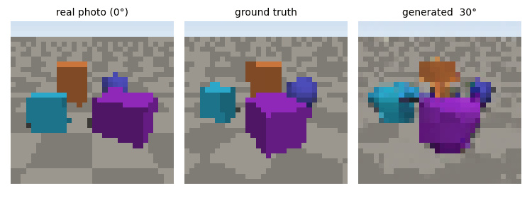
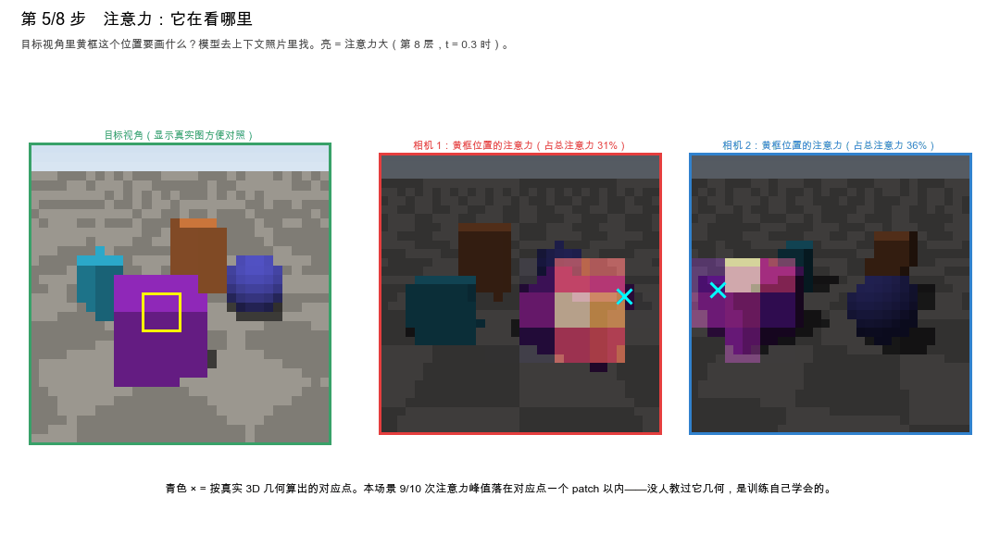
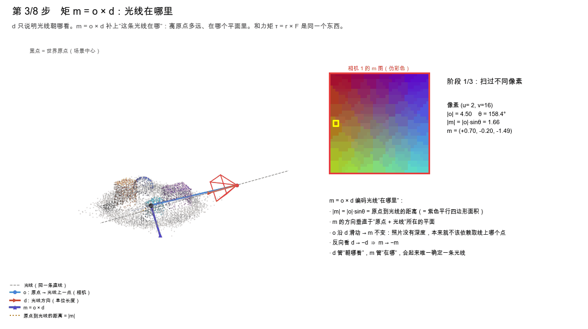
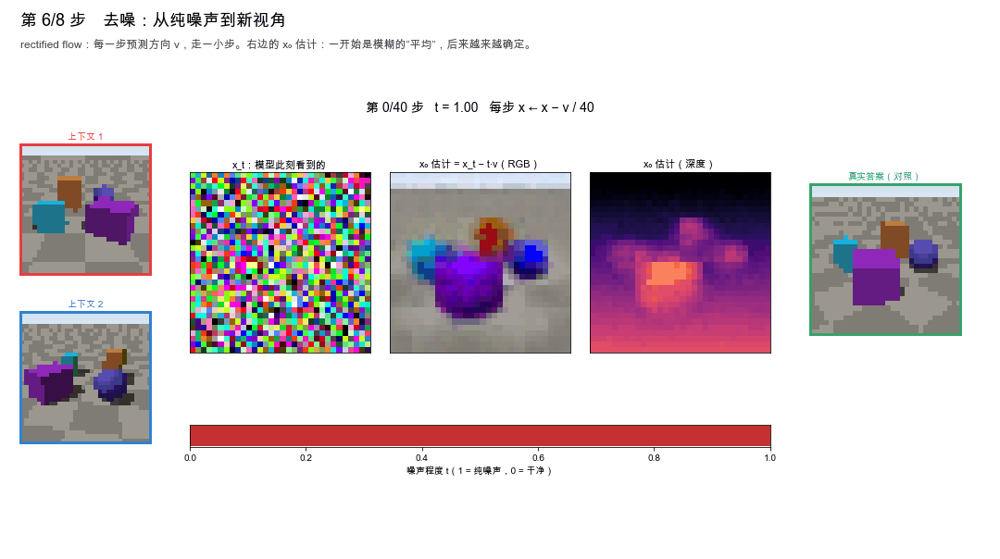
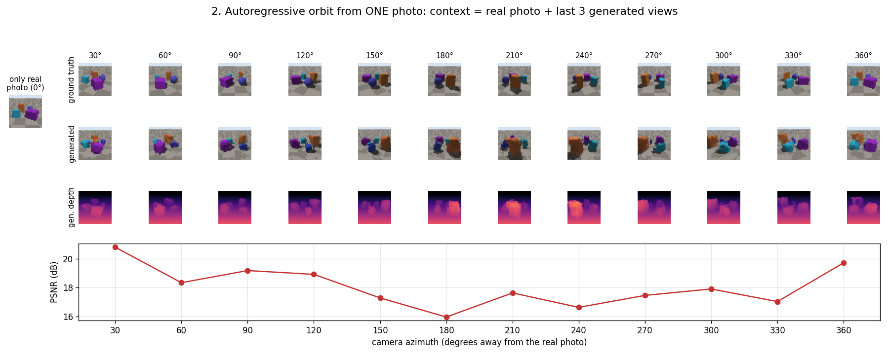
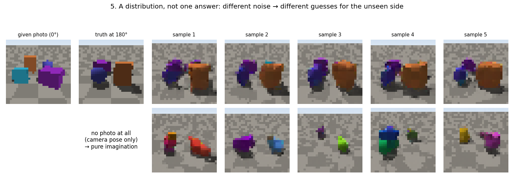

# tiny-atlas

**English** | [中文](README.zh-CN.md)

A tiny **world model** that you can train on a laptop in about an hour and run end to end. It is built for teaching the ideas behind models like World Labs' [Atlas](https://www.worldlabs.ai/blog/atlas).

**Multi-view data → Plücker camera encoding → Transformer → rectified-flow denoising → autoregressive novel views → depth → point cloud**



> This is an independent educational implementation and is not affiliated with World Labs. Atlas has no public paper or code. The design choices here (in particular, encoding camera pose with Plücker rays) are reasonable guesses based on common practice in the field, not Atlas's actual implementation.

## Quick start

```bash
pip install -r requirements.txt
python walkthrough.py     # step-by-step walkthrough (recommended): opens a window and reveals the model's internals
python demo.py            # writes six demo figures to out/
```

Trained weights are included (`checkpoints/atlas_mini_ema.pt`, about 40 MB), so the demos run right after cloning. The Mac GPU (MPS) is used automatically on Apple Silicon; otherwise it runs on the CPU.

To train from scratch:

```bash
python train.py           # about 1 hour on an Apple Silicon GPU (24,000 steps); saves a preview to checkpoints/previews/ every 2,000 steps
```

## Step-by-step walkthrough

```bash
python walkthrough.py            # takes about 10 s to start (everything is precomputed up front)
python walkthrough.py --scene 2  # another test scene never seen during training
python walkthrough.py --gif      # no window: record each step as a GIF (each under 2 MB) into out/gifs/
python walkthrough.py --export   # no window: save the first / middle / last frame of each step as PNGs
```

Keys: **→ / Space** next step · **←** previous step · **R** replay the current animation · **Q** quit

The on-screen captions are in Chinese.

| Step | What you see | Animation |
|---|---|---|
| 1 World and cameras | Scene point cloud, frustums of 3 cameras, two photos and a "?" | The 3D view slowly rotates |
| 2 Plücker rays | A fan of rays shot from a camera, plus the d and m maps of two cameras | Rays appear one by one |
| 3 Moment m = o × d | Origin, o, d, their parallelogram and m in 3D, next to the m map and live numbers | Sweep across pixels / slide o along the ray (m unchanged) / look the other way (m → −m) |
| 4 Tokens | A photo cut into an 8×8 grid → 3 groups of tokens (2 context + 1 noisy target) | Tokens light up one by one |
| 5 Attention | A yellow box in the target view → attention heat map over the context photos, with the true correspondence marked × | Cycles through positions |
| 6 Denoising | x_t, the model's estimate of x₀ (RGB and depth), and a t progress bar | 40 denoising steps, frame by frame |
| 7 Autoregression | The context window, a top-down map of camera positions, and 12 views generated one after another | One new view per second |
| 8 Growing 3D | Depth from each generated view fused into a point cloud | Grows while rotating |

**Step 5: attention learns 3D correspondence by itself.** For a position in the target view (yellow box), the bright areas show where the model looks in the context photos, and the cyan × marks the correspondence computed from the true 3D geometry. On test scenes, the attention peak in the last three layers lands within one patch of the true correspondence 76–84% of the time (versus about 12 px away for a random guess). The model was never taught geometry.



**Step 3: m = o × d encodes *where* a ray is.** |m| is the distance from the origin to the ray. Sliding o along the ray leaves m unchanged; since a photo carries no depth, the encoding should not depend on which point of the ray you pick. Looking the opposite way flips the sign of m.



**Step 6: denoising.** The bottom row is the model's estimate of x₀ at each step: first a blurry "average", then it gradually commits to one answer.



## Demo figures (demo.py)

```bash
python demo.py                 # six figures + orbit.gif in out/
python demo.py --scene 3       # another test scene
python demo.py --cfg 1.0       # turn off classifier-free guidance for comparison
```

1. **The more it sees, the less it imagines**: with 1 / 2 / 4 context views of the same scene, novel views get closer to the truth (PSNR goes up)
2. **Autoregressive orbit**: from a single photo, each generated view is fed back as context. PSNR is lowest directly behind the scene (pure imagination) and recovers on the way back
3. **Point cloud**: generated depth is backprojected, fused across views and compared with the true point cloud
4. **Denoising**: x_t and the model's estimate of x₀ at each step
5. **A distribution, not one answer**: the same photo with different noise gives different plausible guesses for the unseen back side; with no photo at all, it is pure imagination
6. **Training curve**: every batch is a brand-new random world, so the model cannot memorize answers





## Code layout

| File | Contents | Concept |
|---|---|---|
| `scenes.py` | Random scenes (floor + boxes / spheres), ray-cast RGB-D rendering; `plucker()`; `backproject()` | Camera pose math, depth backprojection |
| `model.py` | `AtlasMini`: patch tokens + Plücker + role + position, adaLN time conditioning, bidirectional attention; `generate_view()` with CFG | Core architecture, spatial context |
| `train.py` | `flow_loss()`: sample ε and t, build x_t, target ε − x₀, MSE | Rectified flow |
| `demo.py` | Six demo figures | Autoregression, 3D output |
| `walkthrough.py` | Eight-step interactive walkthrough | The whole pipeline |

Code comments are in Chinese.

## How it differs from the real Atlas

| | tiny-atlas | Atlas |
|---|---|---|
| Scale | 32×32, about 10M parameters, 1 hour of training | 1440p, parameter count not disclosed |
| VAE | None; denoises directly in pixel space | Latent diffusion |
| Data | Procedurally generated block worlds | Real-world images, video, poses and depth |
| Inference | Recomputes the whole sequence at every step | LLM inference techniques such as KV caching |
| Pose encoding | Plücker rays | Not disclosed (Plücker rays are common practice; this is a guess) |

## Lessons learned while training

- **The distribution of the noise time t matters.** The first run used SD3's logit-normal sampling, which almost never trains t < 0.1 (only 1.4% of samples), and the outputs were full of leftover noise. Switching to uniform sampling fixed it. Takeaway: the noise schedule should depend on resolution, and SD3's setting targets high-resolution images.
- **EMA needs a warm-up.** Early in training, an EMA with decay 0.999 is still mostly the random initial weights, so early checkpoints generated worse samples than the raw weights.
- **matplotlib animations freeze on macOS.** After calling `timer.stop()` inside a timer's own callback, no timer fires again. `walkthrough.py` therefore keeps a single timer running for the whole session and advances frames based on elapsed time.
